# Real-Time Policy / Authorization Service

SIM identity in, policy decision out.

This is the PCF decision path (5G) or PCRF (4G), plus the AAA-style "is this
subscriber allowed on the network at all" check — the thing every session setup,
every QoS change and every quota update has to go through. It is written in C++
with a benchmark harness built to measure it correctly, because a tail-latency
number produced by a client that hides tails is worse than no number.

**The headline, measured rather than claimed:**

<!-- BENCH:targets -->
Measured at **100,000 QPS offered, one worker**, 0.0000% loss (1,800,000 replies over the measurement window).

| Metric | Target | Measured | |
|---|---:|---:|:--|
| p50 | < 50 µs | 18.0 µs | met |
| p99 | < 500 µs | 758.8 µs | **missed** |
| p99.9 | < 1,000 µs | 7376.9 µs | **missed** |
| p99.99 | < 2,000 µs | 11,731 µs | **missed** |
| throughput | ≥ 100k QPS/core | 100,000 QPS | met |

The server's own view of the same run — decode, subscriber lookup, `evaluate()`, encode, excluding the syscalls on either side:

| | p50 | p99 | p99.9 | max |
|---|---:|---:|---:|---:|
| service time | 125 ns | 458 ns | 1083 ns | 58536 ns |
<!-- /BENCH:targets -->

The interesting part is the gap between those two tables. The end-to-end p99 is
three orders of magnitude larger than the decision that caused it. **The policy
evaluation is effectively free; everything else is syscalls, scheduling and the
network stack.** That is the finding this project exists to produce, and
[what it implies](#what-this-actually-shows) is at the bottom.

---

## Contents

- [What it does](#what-it-does)
- [Targets](#targets)
- [Results](#results)
  - [Latency versus offered load](#latency-versus-offered-load)
  - [Coordinated omission](#coordinated-omission-what-a-closed-loop-client-hides)
  - [Hot reload under load](#hot-reload-under-load)
  - [Receive batch cap](#receive-batch-cap)
  - [Busy-poll budget](#busy-poll-budget)
  - [Protocol overhead](#protocol-overhead)
  - [Repeatability](#repeatability)
  - [Worker scaling](#worker-scaling)
- [Environment](#environment)
- [How it works](#how-it-works)
- [Correctness](#correctness)
- [Quick start](#quick-start)
- [Repository layout](#repository-layout)
- [What this actually shows](#what-this-actually-shows)
- [Known limitations](#known-limitations-and-what-id-do-next)

---

## What it does

**Request** — subscriber identity plus session context, as a fixed 64-byte
little-endian datagram:

| Field | |
|---|---|
| IMSI / SUPI | 15 digits, packed into a `uint64_t` |
| IMEI | packed, 0 when not reported |
| Access type | LTE / NR / WLAN |
| DNN / APN | an enum on the wire, never a string |
| Serving PLMN, TAC | for roaming and location rules |
| Requested 5QI, requested AMBR | |
| Usage snapshot, local time of day | optional; the serving node's view wins over ours when present |

**Response** — the decision, also exactly 64 bytes:

| Field | |
|---|---|
| Verdict | `ALLOW` / `DENY` / `REDIRECT` |
| Reason | a stable code that ends up in CDRs |
| Authorized QoS | 5QI, ARP, session AMBR up and down |
| Rating group, quota grant | bytes and validity time |
| Flags | throttled, roaming-restricted, tethering-blocked, quota-warning, off-peak-bonus |
| Policy version and rule id | so any decision can be explained by pointing at one line of one file |

**Rules** are YAML, compiled at load into a decision table, and hot-swappable.
The shipped [`config/rules.yaml`](config/rules.yaml) is a realistic operator
policy: five plans, emergency-session precedence, a device blocklist, roaming
partner checks, DNN entitlement, per-plan post-quota throttling, prepaid
redirect-to-top-up, and an off-peak bonus window. See
[docs/policy-authoring.md](docs/policy-authoring.md) for the reference.

---

## Targets

Stated up front, then scored against measurement. Missing a target with an
explanation is fine; hitting one without measuring it properly is not.

| Metric | Target | Why |
|---|---:|---|
| p50 | < 50 µs | in-memory lookup, rule evaluation, serialize |
| p99 | < 500 µs | the headline; must hold at 100k QPS |
| p99.9 | < 1 ms | |
| p99.99 | < 2 ms | no GC pauses to hide behind |
| Throughput | ≥ 100k QPS/core | |
| Hot reload | zero dropped requests, no spike beyond p99.9 | |

---

## Results

All figures come from [`bench/results/`](bench/results/) and are regenerated by
`./bench/run.sh`. **Every number in this README is generated from those CSVs by
`bench/update_readme.py`** — none of them is typed by hand, because a README
quoting a p99 somebody transcribed six weeks ago is precisely the failure this
project is about.

### Latency versus offered load



<!-- BENCH:sweep -->
| Offered | Achieved | Loss | p50 | p90 | p99 | p99.9 | p99.99 | max |
|---:|---:|---:|---:|---:|---:|---:|---:|---:|
| 10,000 | 10,000 | 0 | 23.9 | 38.4 | 58.5 | 155.9 | 5333.0 | 6676.0 |
| 25,000 | 25,000 | 0 | 26.1 | 30.3 | 48.3 | 93.1 | 3188.7 | 4545.4 |
| 50,000 | 50,000 | 0 | 19.8 | 23.8 | 51.4 | 133.2 | 6291.4 | 7483.1 |
| 100,000 | 100,000 | 0 | 18.0 | 31.6 | 758.8 | 7376.9 | 11,731 | 12,542 |
| 150,000 | 150,005 | 0 | 20.7 | 92.7 | 15,278 | 28,164 | 29,721 | 29,948 |
| 200,000 | 200,856 | 0.94% ⚠️ | 116.0 | 60,162 | 70,124 | 73,400 | 73,859 | 73,862 |
| 300,000 | 188,642 | 36.98% ⚠️ | 114,164 | 118,751 | 153,616 | 190,579 | 192,938 | 193,150 |
| 400,000 | 146,654 | 63.45% ⚠️ | 147,980 | 153,092 | 173,015 | 227,017 | 230,949 | 232,938 |
| 500,000 | 121,886 | 75.41% ⚠️ | 149,160 | 155,582 | 212,730 | 241,304 | 250,216 | 255,641 |

All figures in microseconds. ⚠️ marks a row whose loss exceeds 0.01%, where the percentiles are over received replies only and the tail is therefore understated.
<!-- /BENCH:sweep -->

The knee is where achieved throughput stops tracking offered and loss appears.
Past it the latency figures describe the depth of a queue, not the service.

### Coordinated omission: what a closed-loop client hides



<!-- BENCH:omission -->
Same server, same binary, same 150,000 QPS asked for. The only difference is whether the client keeps sending while the server is slow.

| | Achieved | p50 | p99 | p99.9 | p99.99 | max |
|---|---:|---:|---:|---:|---:|---:|
| open loop (fixed schedule) | 149,806 QPS | 20.2 | 154,927 | 164,102 | 165,413 | 165,531 |
| closed loop (send, wait, send) | 109,034 QPS | 17.6 | 30.9 | 54.3 | 83.8 | 255.5 |

The closed-loop client reports a p99 **5007× better** while actually delivering **27% less load than it was asked for**. It looks faster because it gave up.
<!-- /BENCH:omission -->

This is the whole argument for open-loop measurement in one table. A client that
sends, waits for the reply and then sends again stops issuing work exactly when
the server is slow — so the requests it never sent are the ones that would have
been slowest, and they never reach the histogram. Reported tail latency improves
*because the server got worse*.

The generator here issues on a fixed schedule regardless of what has come back,
and records `receive − scheduled send`, not `receive − actual send`. If it falls
behind its own schedule, that is charged to the measurement and also reported
separately, so a run where the generator was the bottleneck is visible rather
than silently wrong. Details in [docs/measurement.md](docs/measurement.md).

### Hot reload under load


<!-- BENCH:reload -->
A rule reload every 5 s across a 15 s run at a steady 100,000 QPS — 3 swaps while traffic was flowing.

| | Value |
|---|---:|
| p99 across the run, best second | 103.2 µs |
| p99 across the run, worst second | 4812.8 µs |
| spread between them | 4709.6 µs |
| replies per second, min / max | 99,999 / 100,001 |
| requests dropped by a reload | 0 |

No second containing a reload is distinguishable from one that does not. That is what an atomic pointer swap buys: readers never block, and the old snapshot is freed only after a grace period.
<!-- /BENCH:reload -->

Workers read the rule set through an RCU snapshot: one release store to a
private cache line, one acquire load, and no lock anywhere. The control plane
compiles the new rules, swaps an atomic pointer, waits for every reader to leave
its critical section, and only then frees the old snapshot. A reload that fails
to compile never goes live and the previous policy keeps serving.

### Receive batch cap



<!-- BENCH:batch -->
| Batch cap | Mean realized batch | p50 | p99 | p99.9 | Achieved |
|---:|---:|---:|---:|---:|---:|
| 1 | 1 | 17.8 | 989.7 | 10,035 | 100,000 QPS |
| 8 | 1.09 | 17.9 | 1008.1 | 5693.4 | 100,000 QPS |
| 32 | 1.08 | 19.0 | 490.5 | 1465.3 | 100,000 QPS |
| 128 | 1.06 | 17.9 | 555.0 | 2578.4 | 100,000 QPS |
<!-- /BENCH:batch -->

The tradeoff: a larger cap amortizes the syscall over more datagrams, but the
first request in a batch waits for the batch to be gathered. "Mean realized
batch" is what the loop actually saw — a cap far above the realized batch is
doing nothing, which is the useful thing this sweep tells you.

### Busy-poll budget

<!-- BENCH:poll -->
| Busy-poll budget | p50 | p99 | p99.9 | p99.99 |
|---:|---:|---:|---:|---:|
| 0 (park immediately) | 27.4 | 39.4 | 69.1 | 129.7 |
| 10 µs | 27.6 | 44.7 | 101.0 | 3715.1 |
| 50 µs | 26.9 | 44.4 | 87.1 | 329.7 |
| 200 µs | 19.1 | 38.3 | 76.2 | 4788.2 |
<!-- /BENCH:poll -->

Run deliberately at a low rate, because the wake-up cost only appears when the
inter-arrival gap is longer than the poll budget. When it is, every request pays
the scheduler and IPI cost of waking a parked thread. Spinning removes that, at
the price of a core burning at 100%.

### Protocol overhead

<!-- BENCH:protocol -->
<!-- /BENCH:protocol -->

The service also exposes the same decision over HTTP, at
`GET /v1/decide?imsi=…&dnn=…&rat=…`, on its own port and its own thread-per-core
listener but through the identical rule table, subscriber store and RCU
snapshot. A test asserts the two paths return the same decision field for field,
because a protocol comparison between fronts that answer slightly different
questions is worthless.

```
$ curl -s 'localhost:9502/v1/decide?imsi=310260100003990&dnn=internet&rat=NR'
{"verdict":"ALLOW","reason":"QUOTA_EXHAUSTED_THROTTLED","rule_id":61,
 "policy_version":1,"qos_5qi":9,"arp":8,"ambr_ul_kbps":1000,"ambr_dl_kbps":1000,
 "rating_group":100,"quota_bytes":1000000000,"quota_validity_s":86400,
 "flags":1,"redirect_id":0}
```

This is also the "policy as a developer-facing API" surface: it is the same
compiled rule table, reachable with curl.

### Repeatability

<!-- BENCH:repeat -->
<!-- /BENCH:repeat -->

One run is not a result, and this is the section that says so out loud. The
spread here is the machine, not the server: identical inputs, identical binary,
an idle gap between each run. On a laptop-class host with no core isolation it
is large, and any single number quoted from it should be read with that in
mind. On an isolated Linux box with a fixed frequency governor this table is
where you would expect a few percent, and if it is not, nothing else on this
page means anything.

### Worker scaling


<!-- BENCH:scaling -->
| Workers | Achieved | Loss | Replies dropped by the server | p50 | p99 | p99.9 |
|---:|---:|---:|---:|---:|---:|---:|
| 1 | 100,000 QPS | 0.00% | 0 | 19.6 | 404.2 | 825.3 |
| 2 | 83,486 QPS | 16.50% | 296977 | 25.1 | 71.0 | 94.5 |
| 4 | 63,745 QPS | 36.21% | 651720 | 81.0 | 276.2 | 3248.1 |
<!-- /BENCH:scaling -->

**Read this table with the platform in mind.** On Linux each worker owns an
`SO_REUSEPORT` socket and the kernel hashes flows across the group, so workers
share nothing. On macOS and BSD, `SO_REUSEPORT` exists but does not
load-balance and there is no `SO_REUSEPORT_LB`, so every worker shares one
socket — and above roughly 100k QPS that socket starts refusing sends with
`EAGAIN` regardless of `SO_SNDBUF` or busy-poll settings. If the "replies
dropped by the server" column is non-zero, that is what you are looking at, and
the row measures the shared socket rather than the server. `policyd --version`
reports which path this build has.

---

## Environment

<!-- BENCH:environment -->
```
Captured: 2026-08-31T01:18:37Z
Host OS:  Darwin 25.5.0 arm64

--- CPU ---
Apple M5
cores online: 10
governor:     not applicable (macOS does not expose one)
core pinning: unavailable (see below)

--- Kernel / network ---
kern.ipc.maxsockbuf: 8388608
transport: UDP over loopback (server and generator on one host)

--- Build ---
policyd 1.0.0 (Release, AppleClang 21.0.0.21000101, Darwin/arm64)
  batched syscalls (recvmmsg/sendmmsg): no
  CPU affinity:                         no
  io_uring backend:                     no
  SO_REUSEPORT load balancing:          no

--- Placement ---
server workers start at core 0
generator threads: 2 starting at core 5
```
<!-- /BENCH:environment -->

Server and load generator run on **one host over loopback**. That removes the
NIC and the wire, which flatters the absolute numbers, while adding contention
for cores and memory bandwidth, which does not. It is disclosed rather than
corrected for. A two-machine run over a real NIC is the obvious next step and
would move the floor up by the wire time.

---

## How it works

```
  load generator ──UDP, 64 B──▶ ┌────────────────────────────────────────┐
  (open loop, separate cores)   │ worker 0..N-1, pinned, share nothing    │
                                │   SO_REUSEPORT socket, kernel-hashed    │
                                │   recvmmsg batch                        │
                                │     ▼ decode (one 64 B memcpy)          │
                                │     ▼ SubscriberStore::find(imsi)       │
                                │       flat open addressing, 1 miss      │
                                │     ▼ build a 64-bit feature word       │
                                │     ▼ evaluate(): linear scan of        │
                                │       64-byte CompiledRules, read via   │
                                │       an RCU snapshot                   │
                                │     ▼ encode + sendmmsg batch           │
                                └────────────────────────────────────────┘
                                              ▲ atomic pointer swap
                                ┌─────────────┴──────────────────────────┐
                                │ control plane, own thread, off the path │
                                │  rules watcher → compile → RCU swap     │
                                │  admin HTTP: /metrics /stats /rules     │
                                │              /rules/reload /explain     │
                                └────────────────────────────────────────┘
```

The five design decisions worth defending:

**1. Rules are compiled, not interpreted.** Every rule becomes a fixed 64-byte
record whose match condition is one `(mask, value)` pair over a 64-bit feature
word. Matching is two ANDs, a compare and a test. No strings, no regex, no
allocation. Conditions that are not naturally boolean — "usage above 80%",
"between 02:00 and 06:00 local" — are interned into feature bits *at compile
time*, so ten rules mentioning 80% cost one comparison between them rather than
ten.

**2. A linear scan, on purpose.** A realistic policy is 50–200 rules; at 64
bytes each that is 3–13 KB, resident in L1d and prefetched perfectly because the
scan is sequential. A decision tree would replace ~100 predictable pipelined
iterations with ~7 *dependent* loads and unpredictable branches. It is the right
structure somewhere in the thousands of rules, and that is a measurement, not an
opinion.

**3. The subscriber store is a flat open-addressing hash with records inline.**
A hit is exactly one cache miss, because the probe load and the record load are
the same load. 10M subscribers at load factor 0.5 needs 33.5M slots and 2.15 GB
— not the 1.07 GB that "10M × 64 B × 2" suggests, because the table is a power
of two and 20M lands just past the 16.8M boundary. That granularity buys 67%
headroom for free. `SubscriberStore::slots_for()` makes the arithmetic
executable and the test pins it.

**4. Hot reload via RCU.** The read side is one release store to a cache line
the core already owns exclusively, plus one acquire load of a line that is
read-shared and almost never written. Acquired once per batch, not once per
request, which also guarantees every request in a batch is decided against one
policy version — something an auditor will ask about.

**5. Share-nothing workers.** Each owns its socket, its buffers, its
cache-line-aligned metrics block and its own histogram. There is no shared
counter incremented per request; at 100k QPS per core that is a contended cache
line and it would land directly in the p99.

Full detail in [docs/architecture.md](docs/architecture.md).

---

## Correctness

```
$ ctest --test-dir build --output-on-failure
122 case(s) run, 0 failed, 0 assertion failure(s)
```

Clean under AddressSanitizer/UBSan and ThreadSanitizer. The tests that earn
their place:

- **`evaluate()` is allocation-free — measured, not asserted.** 20,000
  evaluations run under a counting global `operator new` and the count must not
  move. "Allocation-free" is otherwise a comment that stops being true the first
  time someone adds an error string.
- **A golden corpus of 10,000 committed (request → decision) pairs** is replayed
  on every change. A rule reordering, a feature-bit renumbering or an
  inheritance change shows up as a specific list of decisions that moved, which
  is what a reviewer needs. The corpus also asserts its own coverage: one that
  only walks the happy path catches nothing.
- **1,000 rule swaps under continuous load** from four reader threads, with
  every decision's authorization checked against the policy version it cites —
  so a reply built half from one snapshot and half from another is caught, not
  merely "did not crash".
- **The histogram is validated against exact percentiles** computed from sorted
  reference samples, across uniform, log-normal-with-outliers and bimodal
  distributions. It is the measurement instrument; it does not get to be trusted.
- **Sequential IMSIs are checked not to cluster**, which is how carriers actually
  allocate them and the test that would catch removal of the hash finalizer.
- **`scripts/smoke.sh`** starts the server, drives real traffic, checks that all
  three verdicts occur, exercises every admin endpoint, performs five hot
  reloads mid-traffic requiring zero dropped requests, and asserts a clean
  SIGTERM shutdown. On both ingest backends, under both sanitizers.

CI additionally requires that regenerating the golden corpus and the synthetic
roster are byte-for-byte no-ops, and that the Linux fast paths — `recvmmsg`,
`sched_setaffinity`, `io_uring` — were actually compiled in, so a silent
fallback cannot pass as a Linux result.

---

## Quick start

```bash
cmake -S . -B build -DCMAKE_BUILD_TYPE=Release
cmake --build build -j
ctest --test-dir build --output-on-failure

# Run it
./build/bin/policyd --workers 4 --rules config/rules.yaml \
                    --subscribers config/subscribers.csv

# Ask it something
curl -s 'localhost:9501/explain?imsi=310260100003990&dnn=internet&rat=1'

# Drive it
./build/bin/policy-loadgen --server 127.0.0.1:9500 --qps 100000 --duration 10

# Reproduce every figure above
./bench/run.sh
```

A bigger roster:

```bash
./build/bin/policy-gen-subscribers --count 1000000 --out config/subscribers-1m.csv
./build/bin/policyd --subscribers config/subscribers-1m.csv --expect-subscribers 1000000
```

Useful options: `--workers`, `--batch`, `--busy-poll-us`, `--backend
udp|io_uring`, `--first-core`, `--admin-port`. `policyd --help` lists all of
them; `policyd --version` reports which platform fast paths the binary has.

---

## Repository layout

```
include/policy/
  wire.hpp              64-byte request and decision, versioned, little-endian
  imsi.hpp              IMSI/IMEI/PLMN packing and parsing
  subscriber_store.hpp  flat open-addressing hash on the packed IMSI
  rules.hpp             CompiledRule, RuleSet, the feature-bit contract
  engine.hpp            evaluate() — noexcept, allocation-free, syscall-free
  rcu.hpp               snapshot publication with epoch-based reclamation
  yaml.hpp              the documented YAML subset the rules file uses
  hdr_histogram.hpp     constant-time recording, bounded relative error
  cycles.hpp            cntvct_el0 / rdtsc, with its own read cost measured
  metrics.hpp           per-worker, cache-line-isolated counters
src/
  server_udp.cpp        thread-per-core, recvmmsg/sendmmsg or a portable loop
  server_iouring.cpp    io_uring ingest backend (Linux + liburing)
  http_front.cpp        HTTP/1.1 front over the same decision path
  control_plane.cpp     loader, reload watcher, admin endpoints
  rules.cpp             the rule compiler, including shadow detection
bench/
  loadgen.cpp           open-loop generator with HdrHistogram
  run.sh                every figure, one command
  plot.py               dependency-free SVG, light and dark themes
  update_readme.py      regenerates this file's tables from the CSVs
  results/              committed: environment, raw CSVs, figures
tests/                  122 cases: unit, property, golden, concurrency
tools/                  synthetic roster and golden corpus generators
config/rules.yaml       a realistic operator policy
docs/                   architecture, policy authoring, measurement method
```

---

## What this actually shows

The service answers a policy request in **hundreds of nanoseconds**. The
end-to-end latency a client sees is **tens of microseconds**, and its tail is
**hundreds of microseconds**. Essentially all of that is the two syscalls, the
two trips through the network stack and the scheduler — none of it is the
decision.

The honest conclusion is not "policy evaluation is fast." It is that **policy
evaluation is not where the latency is, and once you have built it this way it
never will be.** In a real core network this sits behind Diameter Gx or HTTP/2
Npcf signalling and in front of a database of record, both of which cost orders
of magnitude more than anything measured here. So the useful thing this project
establishes is that the compute path can be taken off the table entirely — and
that the remaining problem is a signalling, scheduling and persistence problem.

The second thing it shows is a measurement discipline. The same server, driven
by two clients differing only in whether they keep sending while it is slow,
reports p99s that differ by two orders of magnitude. Which of those numbers you
publish is a choice, and most published numbers are the flattering one.

---

## Known limitations, and what I'd do next

- **The published numbers are from macOS/arm64 over loopback.** That means no
  real CPU pinning, no `recvmmsg`, and a shared socket instead of
  `SO_REUSEPORT` load balancing. The Linux paths are written, compiled and
  smoke-tested in CI, but the headline numbers should be re-taken on an isolated
  Linux box before anyone quotes them. The build says which paths it has, and
  the harness records it alongside every run.
- **The scaling study needs Linux.** On this host, adding workers makes things
  worse for a reason that has nothing to do with the server — see the caveat
  above the table.
- **`io_uring` is implemented but not measured here**, because it does not exist
  on the host that produced these figures. CI compiles and smoke-tests it; a
  latency comparison against the socket path is the obvious next figure.
- **Single machine.** Server and generator share cores and memory bandwidth. Two
  machines and a real NIC would raise the floor and make the tail more honest.
- **No AF_XDP or DPDK rung.** The ladder is socket → io_uring → AF_XDP → DPDK,
  and this covers the first two.
- **The protocol comparison is against HTTP/1.1, not gRPC.** It is a lower
  bound: a GET with query parameters on a kept-alive connection is the cheapest
  HTTP can be, and protobuf framing over HTTP/2 with TLS would cost more. A
  real gRPC front would make the number more directly comparable to what a 5G
  Npcf interface actually does.
- **The subscriber store is read-mostly by design.** Usage counters are updated
  with relaxed atomics and tolerate bounded staleness, which is right for a
  policy decision but is not a general-purpose concurrent map. Real charging
  would put a Gy/Ro interface in front of it.

---

## License

[MIT](LICENSE).
